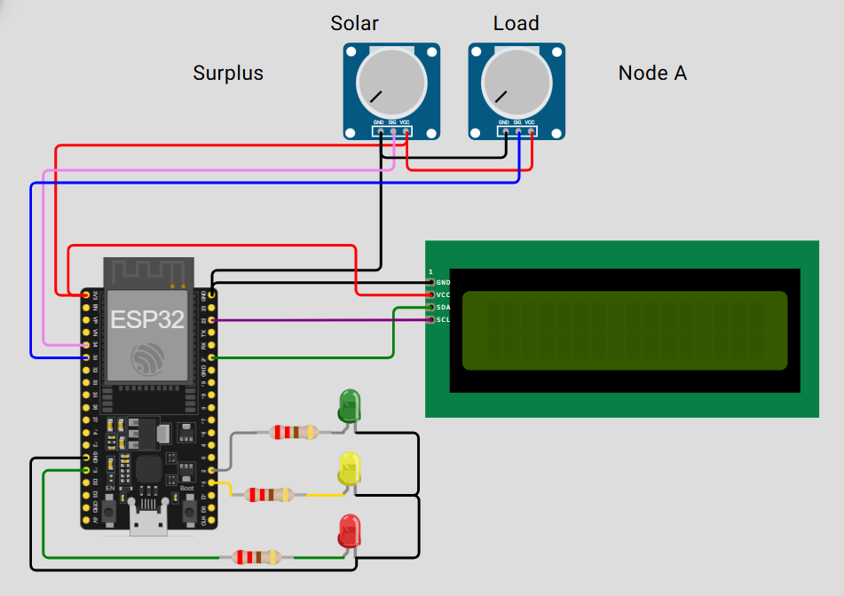

<div align="center">

# Arc Solar Micro-Grid P2P Settlement

### Machine-to-machine solar energy trading with real USDC settlement on Arc testnet

Two simulated smart-home nodes autonomously trade solar surplus for USDC. No utility, bank, or human in the loop.


</div>

---

# Overview

I built this for the [Arc Hackathon: Programmable Money](https://community.arc.io), to explore what Arc calls the autonomous machine economy: devices that can transact value with each other without a person or institution in between.

The setup is two simulated ESP32 nodes, Node A and Node B, each generating and consuming solar power on its own. When one has a surplus and the other has a deficit, they settle a real USDC payment directly between themselves on Arc testnet, using the Circle Developer-Controlled Wallets SDK. No utility company, no bank, no one clicking "approve."

---

# Features

- Real USDC settlement on Arc testnet via Circle Developer-Controlled Wallets
- Two independent ESP32 nodes simulated in Wokwi, running identical firmware
- Live dashboard with real-time solar/load and settlement updates over WebSocket
- Persistent trade and reading history via Supabase
- Publicly reachable via Cloudflare Quick Tunnel
- Direct peer-to-peer match, no intermediary verification agent

---

# Technology Stack

| Category | Technology |
|---|---|
| Firmware | Arduino/C++ on ESP32 (Wokwi simulated) |
| Transport | HTTP POST (ESP32 → server) |
| Backend | Node.js, Express, `ws` |
| Payments | Circle Developer-Controlled Wallets SDK, Arc Testnet |
| Persistence | Supabase (Postgres) |
| Dashboard | Vanilla HTML/CSS/JS, WebSocket |
| Public Exposure | Cloudflare Quick Tunnel (`cloudflared`) |

---

# Project Structure

```text
arc-solar-microgrid-demo/
│
├── server.js
├── setup-wallets.js
├── generate-entity-secret.js
├── get-usdc-token-id.js
├── supabase-schema.sql
├── wokwi-schematic-guide.md
├── wokwi-node-firmware/
│   └── (ESP32 firmware, shared by Node A and Node B)
├── public/
│   └── index.html          (live dashboard)
├── diagram/
│   └── circuit-diagram.png
├── package.json
├── .env.example
└── .gitignore
```

---

# Settlement Flow

```text
        Node A (ESP32)              Node B (ESP32)
     Solar / Load readings       Solar / Load readings
              │                          │
              ▼                          ▼
         HTTP POST                  HTTP POST
              │                          │
              └───────────┬──────────────┘
                           ▼
                    Backend Server
                  (matching engine)
                           │
              Surplus on one, deficit on other?
                           │
                          Yes
                           ▼
              Circle Developer Wallets SDK
                           │
                           ▼
              USDC Settlement on Arc Testnet
                           │
                           ▼
         Dashboard update (WebSocket) + Supabase log
```

---

# How It Works

1. Each Wokwi-simulated node reports solar generation and load to the backend over HTTP.
2. The backend's matching engine checks for a surplus on one node and a deficit on the other.
3. On a match, it settles payment directly in USDC using the Circle SDK, on Arc testnet.
4. The live dashboard reflects the update in real time via WebSocket.
5. Every reading and trade is persisted in Supabase, so history survives server restarts.

---

# Simulated Inputs, Important

Solar generation and load aren't read from real sensors. Each node's circuit (see diagram below) uses two potentiometers, labeled "Solar" and "Load," that I turn manually to set arbitrary values and demonstrate surplus/deficit scenarios on demand.



*Both Node A and Node B use this identical circuit. Only `NODE_ID` and `SERVER_URL` differ in firmware.*

---

# Setup

### Prerequisites

- Node.js v18+ (tested on v24.14.0)
- A [Circle](https://console.circle.com) developer account and API key
- A [Supabase](https://supabase.com) project
- A [Wokwi](https://wokwi.com) account
- [`cloudflared`](https://github.com/cloudflare/cloudflared/releases), download it separately, it's not included in this repo

### Install

```bash
npm install
```

### Configure environment

```bash
cp .env.example .env
```

Fill in your own Circle, Supabase, and pricing values. `.env` is git-ignored, never commit it.

### Generate a Circle entity secret

```bash
npm run generate-entity-secret
```

### Create wallets for Node A and Node B

```bash
npm run setup-wallets
```

Copy the resulting wallet IDs/addresses into `.env`.

### Find your USDC token ID

A wallet's USDC balance shows up as two token entries on Arc: one `isNative: true` (a gas-token representation, not transferable) and one `isNative: false` (ERC-20, decimals: 6, this is the one you actually want).

```bash
node get-usdc-token-id.js
```

Put the non-native token ID into `USDC_TOKEN_ID` in `.env`.

### Run the server

```bash
npm start
```

### Expose it publicly (for Wokwi to reach it)

```bash
cloudflared tunnel --url http://localhost:3000
```

Copy the generated `https://*.trycloudflare.com` URL into `SERVER_URL` in both Wokwi node firmwares. This URL changes on every tunnel restart, so you'll need to update it each time.

### Run the Wokwi nodes

Open `wokwi-node-firmware/` in two separate Wokwi projects (wiring details in `wokwi-schematic-guide.md`). Set `NODE_ID` to `A` and `B` respectively.

### Open the dashboard

Visit `http://localhost:3000` or your tunnel URL.

---

# Known Limitations

I built this as a hackathon demo and scoped it accordingly, so a few things are worth being upfront about.

- **No verification layer.** The backend trusts each node's self-reported solar/load values directly. There's no on-chain oracle, physical energy meter, or fraud-detection mechanism confirming the reported generation or consumption actually happened.
- **Simulated inputs.** Solar/load values come from potentiometers, not real sensors (see above).
- **WebSocket support on Render's free tier is unverified** as of this writing. I'll check the dashboard's live-update behavior after deploying there.
- **Cloudflare Quick Tunnel URLs are ephemeral.** Every restart means updating `SERVER_URL` in both firmwares.
- **No Agent Stack / AI decision-making.** The matching engine uses straightforward rule-based logic (surplus vs. deficit), not an AI agent. It fits the Agentic Economy track's theme of autonomous, human-free transacting, but doesn't use Circle's Agent Stack or any learned decision logic. A natural next step would be replacing the matching rule with an actual agent that reasons over pricing, timing, or multiple counterparties.

---

# Why I Built This

Arc's whole pitch is an autonomous machine economy, devices transacting value with each other without a human or institution in the middle. I wanted to build something that actually shows that, not just describes it.

The idea is simple: two smart-home nodes track their own solar surplus and deficit, and settle real USDC payments directly between themselves on Arc testnet whenever the numbers line up. No utility company, no bank, no manual approval. The energy inputs are simulated (see Simulated Inputs above), but the settlement itself is real. Every trade shown on the dashboard is an actual Circle-executed transaction on Arc testnet, and you can verify it on-chain.

This repo has the full stack: ESP32 firmware, the backend matching/settlement engine, the live dashboard, and the persistence layer, everything needed to reproduce the demo end to end.

---

# Future Improvements

- On-chain oracle or attestation layer for energy readings
- Persistent public deployment (Render)
- Real sensor integration
- Multi-node (>2) trading and dynamic pricing

---

# Author

**Ajaj Mahmud Aquil**

Electrical & Electronics Engineering Student • Robotics & Embedded Systems

🌐 Portfolio: [portfolio.ajajaquil.dev](https://portfolio.ajajaquil.dev)

💻 GitHub: [@ajajaquil](https://github.com/ajajaquil)

---

# License

This project is licensed under the **MIT License**.

Copyright (c) 2026 Ajaj Mahmud Aquil